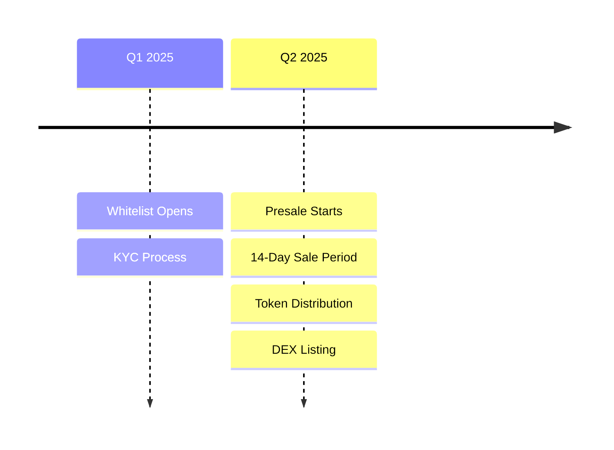

# Presale Information 💰

## Overview

The $SOCIALX presale offers early supporters the opportunity to acquire tokens at a discounted rate before the public launch. This is your chance to be part of the Social X revolution from the beginning!

## 🎯 Presale Details

### Key Metrics

| Parameter | Value |
|-----------|-------|
| **Token Symbol** | $SOCIALX |
| **Presale Allocation** | 20,000,000 tokens (20% of supply) |
| **Exchange Rate** | 1 $HYPE = 20,000 $SOCIALX |
| **Hard Cap** | 1,000 $HYPE |
| **Soft Cap** | 500 $HYPE |
| **Minimum Purchase** | 0.1 $HYPE |
| **Maximum Purchase** | 10 $HYPE per wallet |
| **Presale Duration** | 14 days or until hard cap |
| **Network** | HyperEVM (Chain ID: 999) |

### Price Comparison

| Stage | Price per $SOCIALX | Discount |
|-------|-------------------|----------|
| **Presale** | 0.00005 $HYPE | 50% off |
| **Initial DEX** | 0.0001 $HYPE | - |
| **Target (Month 1)** | 0.0002 $HYPE | -100% gain |

## 📅 Timeline

### Presale Schedule



### Important Dates

| Event | Date | Time (UTC) | Status |
|-------|------|------------|--------|
| **Whitelist Opens** | March 1, 2025 | 12:00 | Upcoming |
| **Presale Starts** | April 1, 2025 | 14:00 | Scheduled |
| **Presale Ends** | April 15, 2025 | 14:00 | - |
| **Token Distribution** | April 16, 2025 | 12:00 | - |
| **DEX Listing** | April 17, 2025 | 14:00 | - |

## 🌊 Initial Liquidity

### Liquidity Provision

| Component | Amount | Purpose |
|-----------|--------|---------|
| **From Presale** | 700 $HYPE (70%) | Initial LP |
| **From Treasury** | 2,800 $HYPE | Additional depth |
| **Total Initial LP** | 3,500 $HYPE | Strong foundation |
| **LP Tokens** | 70M $SOCIALX | Paired liquidity |

### Liquidity Management

- 🔒 **12-month lock** on LP tokens
- 📊 **Transparent tracking** via smart contract
- 🛡️ **Anti-rug protection** built-in
- 📈 **Gradual unlock** after lock period

## 📝 How to Participate

### Step-by-Step Guide

#### Step 1: Prepare Your Wallet

1. **Install MetaMask** or compatible wallet
2. **Add HyperEVM network**:
   ```
   Network: HyperEVM
   Chain ID: 999
   RPC: https://rpc.hyperevm.io
   Symbol: HYPE
   ```
3. **Get $HYPE tokens** for purchase and gas
4. **Have at least** 0.11 $HYPE (0.1 for purchase + gas)

#### Step 2: Whitelist Registration (Optional)

1. **Visit** presale.socialx.io
2. **Connect wallet** to verify address
3. **Complete KYC** if required
4. **Join Telegram** for updates
5. **Get priority access** when presale opens

#### Step 3: Purchase Process

1. **Go to presale page** when live
2. **Connect your wallet**
3. **Enter amount** (0.1 - 10 $HYPE)
4. **Review transaction**:
   - Token amount
   - Exchange rate
   - Gas fees
5. **Confirm purchase** in wallet
6. **Save transaction hash** for records

#### Step 4: Token Distribution

- **Automatic distribution** within 24 hours
- **No claiming needed** - Direct to wallet
- **Add token to wallet**:
  ```
  Token Address: [TBA]
  Symbol: SOCIALX
  Decimals: 18
  ```

## 💎 Allocation Tiers

### Contribution Benefits

| Tier | Contribution | Bonus | Benefits |
|------|-------------|-------|----------|
| **🥉 Bronze** | 0.1 - 1 $HYPE | 0% | Standard rate |
| **🥈 Silver** | 1 - 5 $HYPE | 5% | Bonus tokens |
| **🥇 Gold** | 5 - 10 $HYPE | 10% | Bonus + NFT |
| **💎 Diamond** | 10 $HYPE (max) | 15% | All benefits + DAO role |

### Referral Program

| Referrals | Your Bonus | Friend Bonus |
|-----------|------------|--------------|
| 1-5 | 2% extra | 1% extra |
| 6-10 | 5% extra | 2% extra |
| 11+ | 10% extra | 3% extra |

## 💰 Use of Funds

### Fund Allocation

```
Total Raised: 1,000 $HYPE

Distribution:
├── 70% (700 $HYPE) → Liquidity Pool
├── 15% (150 $HYPE) → Development
├── 10% (100 $HYPE) → Marketing
└── 5% (50 $HYPE) → Operations
```

### Detailed Breakdown

#### Liquidity (70%)
- Initial DEX liquidity provision
- Price stability and depth
- Trading pairs establishment

#### Development (15%)
- Smart contract improvements
- Platform features
- Security audits
- Bug bounties

#### Marketing (10%)
- Community growth
- Influencer partnerships
- Content creation
- Event sponsorships

#### Operations (5%)
- Team salaries
- Legal compliance
- Infrastructure costs
- Admin expenses

## 🎁 Presale Benefits

### Early Investor Advantages

1. **💰 Best Price** - 50% discount vs DEX
2. **🎯 Guaranteed Allocation** - No bots or MEV
3. **🏆 Exclusive NFT** - For Gold+ contributors
4. **🗳️ DAO Voting Power** - Governance rights
5. **💎 Future Airdrops** - Priority for rewards
6. **🌟 OG Status** - Special Discord role
7. **📊 Analytics Access** - Premium features

## ⚠️ Important Information

### Terms & Conditions

- ✅ **No vesting** - Immediate token access
- ✅ **Non-refundable** - All sales final
- ✅ **KYC may be required** for large purchases
- ✅ **One wallet** = One allocation
- ❌ **No US/restricted** jurisdictions

### Risk Disclosure

⚠️ **Investment Risks:**
- Cryptocurrency is volatile
- No guaranteed returns
- Possible total loss
- Regulatory changes
- Technical failures

**Only invest what you can afford to lose**

## 🔒 Security Measures

### Presale Contract Security

| Feature | Status | Details |
|---------|--------|---------|
| **Multi-sig** | ✅ | 3/5 signatures required |
| **Time-locked** | ✅ | No early withdrawals |
| **Audited** | ✅ | CertiK verified |
| **Open source** | ✅ | GitHub published |
| **Emergency pause** | ✅ | Circuit breaker |

### Anti-Scam Protection

🚨 **Official Links Only:**
- Website: presale.socialx.io
- Contract: [TBA - will be posted]
- Telegram: @socialx_official

⚠️ **Never:**
- Send funds to personal wallets
- Share your private keys
- Trust DMs about "special deals"
- Use unofficial links

## 📊 Presale Analytics

### Live Dashboard

Track real-time metrics:
- 📈 Total raised
- 👥 Number of contributors
- ⏱️ Time remaining
- 🎯 Progress to hard cap
- 📊 Average contribution

Visit: [presale.socialx.io/analytics](https://presale.socialx.io/analytics)

## ❓ Frequently Asked Questions

### General Questions

**Q: When will I receive my tokens?**
A: Within 24 hours after presale ends, automatically sent to your wallet.

**Q: Can I buy more than 10 $HYPE worth?**
A: No, maximum is 10 $HYPE per wallet to ensure fair distribution.

**Q: What if soft cap isn't reached?**
A: Full refund minus gas fees if we don't reach 500 $HYPE.

**Q: Can I use multiple wallets?**
A: This violates terms and may result in exclusion.

### Technical Questions

**Q: Which wallet should I use?**
A: MetaMask, Rabby, or any Web3 wallet supporting HyperEVM.

**Q: How much gas do I need?**
A: Approximately 0.01 $HYPE for the transaction.

**Q: Can I buy with other tokens?**
A: No, only $HYPE is accepted during presale.

## 📞 Support

### Get Help

Having issues? Contact us:

- 📧 **Email**: presale@socialx.io
- 💬 **Telegram**: @socialx_support
- 🎫 **Support Ticket**: support.socialx.io
- 📖 **FAQ**: help.socialx.io

### Community Channels

- 🐦 [Twitter Updates](https://twitter.com/socialx)
- 💬 [Telegram Chat](https://t.me/socialx)
- 🎮 [Discord Server](https://discord.gg/socialx)
- 📺 [YouTube Tutorials](https://youtube.com/socialx)

---

**Ready to join the revolution?** 

[**PARTICIPATE IN PRESALE →**](https://presale.socialx.io)

*Be early, be rewarded!* 🚀