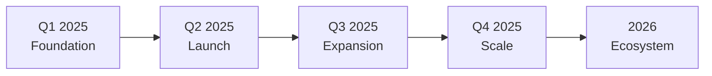

# Development Roadmap 🗺️

## Vision & Mission

### Our Vision
To become the leading social trading platform that seamlessly integrates social media influence with decentralized finance, empowering creators and traders globally.

### Our Mission
Building innovative tools that democratize access to social finance, enabling anyone to tokenize their influence, trade social capital, and participate in the creator economy.

## 🎯 Roadmap Overview



## 📅 Q1 2025: Foundation Phase ✅

### Completed Milestones

#### Platform Development
- ✅ **Core Platform Launch** (January 2025)
  - Trading engine implementation
  - Smart contract deployment
  - Basic UI/UX interface
  
- ✅ **Twitter/X Integration** (January 2025)
  - OAuth authentication
  - Profile verification
  - Social metrics tracking
  
- ✅ **Multi-Chain Support** (February 2025)
  - HyperEVM integration
  - Base network support
  - Wallet connectivity

#### Technical Infrastructure
- ✅ **Smart Contract Development**
  - Token factory contracts
  - Bonding curve implementation
  - Security features

- ✅ **Backend Systems**
  - API development
  - Database architecture
  - Session management

- ✅ **Beta Testing Program**
  - 1,000+ beta testers
  - Bug identification
  - Feature feedback

### Key Achievements
- 🏆 Successfully onboarded 1,000+ beta users
- 🏆 Processed $500K+ in test transactions
- 🏆 Zero critical security incidents
- 🏆 98% uptime during beta

## 🚀 Q2 2025: Launch Phase

### Upcoming Milestones

#### April 2025
- 🎯 **$SOCIALX Token Launch**
  - Contract deployment on mainnet
  - Initial token distribution
  - Liquidity provision

- 🎯 **Presale Event**
  - Public presale opening
  - 1,000 $HYPE hard cap
  - Community allocation

- 🎯 **DEX Listing**
  - HyperSwap listing
  - Initial liquidity: 3,500 $HYPE
  - Trading pairs establishment

#### May 2025
- 🎯 **Airdrop Distribution**
  - Beta tester rewards
  - 2.5M $SOCIALX distribution
  - Claim portal launch

- 🎯 **Staking Platform**
  - Single-sided staking
  - LP staking rewards
  - Auto-compounding options

- 🎯 **Advanced Trading Features**
  - Limit orders
  - Stop-loss functionality
  - Portfolio analytics

#### June 2025
- 🎯 **Marketing Campaign**
  - Influencer partnerships
  - Social media campaigns
  - Community contests

- 🎯 **Platform Optimization**
  - Gas optimization
  - UI/UX improvements
  - Mobile responsiveness

### Expected Outcomes
- 📊 10,000+ active users
- 📊 $10M+ total value locked
- 📊 100+ social tokens launched
- 📊 $1M+ daily volume

## 🌟 Q3 2025: Expansion Phase

### Planned Features

#### July 2025
- 📱 **Mobile Applications**
  - iOS app launch
  - Android app launch
  - Push notifications
  - Biometric authentication

- 🔄 **Copy Trading**
  - Follow top traders
  - Automated strategies
  - Performance tracking
  - Risk management tools

#### August 2025
- 🗳️ **DAO Launch**
  - Governance token utility
  - Proposal system
  - Voting mechanism
  - Treasury management

- 🌉 **Cross-Chain Bridge**
  - Ethereum bridge
  - BSC bridge
  - Polygon bridge
  - Arbitrum bridge

#### September 2025
- 🎨 **NFT Marketplace V2**
  - Enhanced AI generation
  - Collection launchpad
  - Royalty system
  - Auction house

- 📊 **Analytics Dashboard**
  - Advanced metrics
  - Custom indicators
  - Export capabilities
  - API access

### Development Focus
- User experience enhancement
- Scalability improvements
- Security audits
- Community governance

## 🚀 Q4 2025: Scale Phase

### Enterprise Features

#### October 2025
- 🏢 **Institutional Tools**
  - Corporate accounts
  - Bulk trading
  - Custom integrations
  - Compliance tools

- 🔐 **Advanced Security**
  - Multi-sig wallets
  - Hardware wallet support
  - 2FA enhancement
  - Insurance fund

#### November 2025
- 🌍 **Global Expansion**
  - Multi-language support
  - Regional partnerships
  - Localized content
  - Fiat on-ramps

- 🤖 **AI Integration**
  - Trading bots
  - Market predictions
  - Sentiment analysis
  - Automated strategies

#### December 2025
- 💳 **DeFi Integration**
  - Lending/borrowing
  - Yield farming
  - Liquidity mining
  - Synthetic assets

- 🎮 **Gamification**
  - Trading competitions
  - Achievement system
  - Leaderboards
  - Rewards program

### Year-End Goals
- 📈 50,000+ active users
- 📈 $100M+ TVL
- 📈 500+ social tokens
- 📈 $10M+ daily volume

## 🔮 2026 & Beyond: Ecosystem Phase

### Long-term Vision

#### Q1 2026
- **Social Media Platform**
  - Native social features
  - Content monetization
  - Creator tools
  - Community spaces

#### Q2 2026
- **Metaverse Integration**
  - Virtual trading floors
  - Avatar systems
  - Digital real estate
  - VR/AR support

#### Q3 2026
- **Enterprise Solutions**
  - White-label platform
  - B2B services
  - API marketplace
  - SDK release

#### Q4 2026
- **Global Dominance**
  - #1 social trading platform
  - 1M+ users
  - $1B+ TVL
  - Multi-chain leader

## 🎯 Key Performance Indicators

### Success Metrics

| Metric | Q1 2025 | Q2 2025 | Q3 2025 | Q4 2025 | 2026 |
|--------|---------|---------|---------|---------|------|
| **Users** | 1K | 10K | 25K | 50K | 200K |
| **TVL** | $500K | $10M | $50M | $100M | $500M |
| **Tokens** | 10 | 100 | 300 | 500 | 2000 |
| **Volume** | $100K | $1M | $5M | $10M | $50M |
| **Countries** | 10 | 25 | 50 | 100 | 150 |

## 🔧 Technical Roadmap

### Infrastructure Development

```
2025 Q1: Foundation
├── Smart contracts ✅
├── Basic platform ✅
└── Beta testing ✅

2025 Q2: Enhancement
├── Gas optimization
├── Scalability
└── Security audits

2025 Q3: Innovation
├── Layer 2 integration
├── Advanced features
└── AI implementation

2025 Q4: Optimization
├── Performance tuning
├── Cost reduction
└── User experience

2026: Next Generation
├── Web3 social
├── Decentralized compute
└── Quantum resistance
```

## 🤝 Partnership Timeline

### Strategic Collaborations

| Quarter | Partnership Type | Goals |
|---------|-----------------|-------|
| **Q1 2025** | Technical partners | Infrastructure |
| **Q2 2025** | DEX partnerships | Liquidity |
| **Q3 2025** | Influencer network | Growth |
| **Q4 2025** | Institutional | Volume |
| **2026** | Global brands | Adoption |

## 📊 Development Priorities

### Resource Allocation

```
Development Budget Distribution:
├── 35% Core Platform
├── 25% Security & Audits
├── 20% New Features
├── 15% Marketing & Growth
└── 5% Research & Innovation
```

## 🎨 Product Evolution

### Platform Versions

| Version | Release | Features |
|---------|---------|----------|
| **v1.0** | Q1 2025 | Basic trading |
| **v2.0** | Q2 2025 | Token launch |
| **v3.0** | Q3 2025 | Mobile apps |
| **v4.0** | Q4 2025 | Enterprise |
| **v5.0** | 2026 | Ecosystem |

## 🔄 Continuous Improvements

### Ongoing Initiatives

- **Weekly Updates**
  - Bug fixes
  - Performance improvements
  - Security patches
  
- **Monthly Features**
  - New functionalities
  - UI/UX enhancements
  - Integration updates
  
- **Quarterly Reviews**
  - Community feedback
  - Roadmap adjustments
  - Strategic planning

## 📢 Community Input

### Governance Influence

Starting Q3 2025, the DAO will have input on:
- 🗳️ Feature prioritization
- 🗳️ Partnership decisions
- 🗳️ Treasury allocation
- 🗳️ Protocol upgrades
- 🗳️ Roadmap modifications

## 🎯 Success Factors

### Critical Milestones

1. **Technical Excellence**
   - Zero security breaches
   - 99.9% uptime
   - Sub-second transactions

2. **User Growth**
   - Organic acquisition
   - High retention rates
   - Active engagement

3. **Financial Success**
   - Sustainable revenue
   - Token appreciation
   - TVL growth

4. **Community Building**
   - Active governance
   - Strong social presence
   - Developer ecosystem

## 📝 Roadmap Updates

### Stay Informed

- 📅 **Monthly Updates**: Progress reports
- 📊 **Quarterly Reviews**: Detailed analysis
- 🎯 **Real-time Tracking**: [roadmap.socialx.io](https://roadmap.socialx.io)
- 💬 **Community Calls**: Bi-weekly AMAs

---

**Join us on this journey!** 

Follow our progress and contribute to our success:
- 🌐 [Website](https://socialx.io)
- 🐦 [Twitter](https://twitter.com/socialx)
- 💬 [Telegram](https://t.me/socialx)
- 📚 [Blog](https://blog.socialx.io)

*Building the future of social finance, together* 🚀